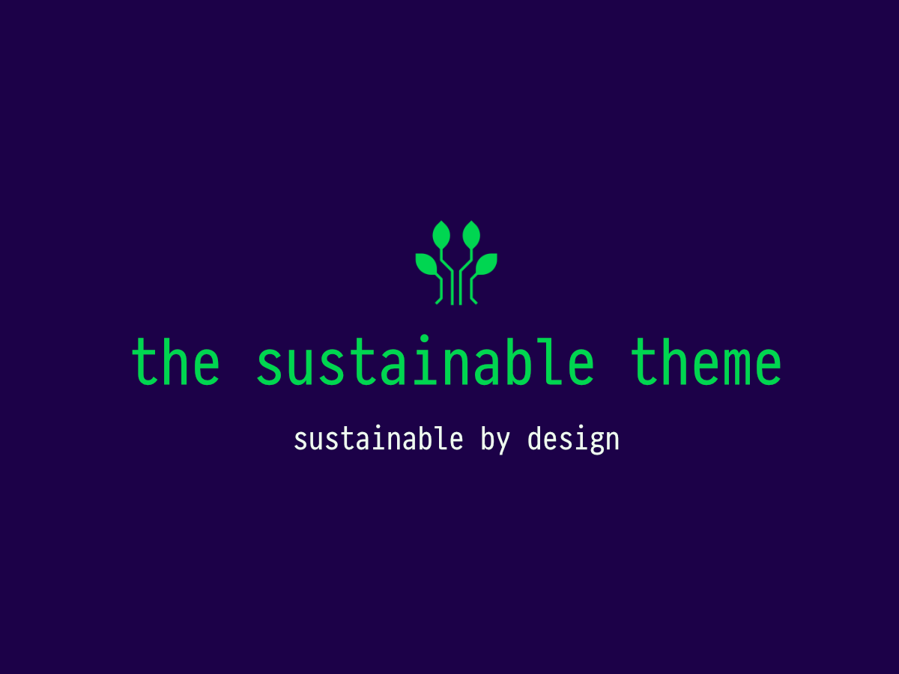

# The Sustainable Theme

A WordPress block theme built for creative sites that care about performance, accessibility, and a smaller digital footprint. It combines a flexible block editor experience with built-in sustainability tooling, design tokens, and a large pattern library.



- **Theme URI:** [pixeltoplanet.earth/the-sustainable-theme](https://pixeltoplanet.earth/the-sustainable-theme)
- **Requires WordPress:** 6.0+
- **Requires PHP:** 8.0+
- **License:** GPL v2 or later

## Features

- **Block theme** — `theme.json`, templates, template parts, and style variations
- **Sustainability optimizer** — configurable performance modes (base, super, custom)
- **Design settings** — admin UI for border-radius tokens synced to CSS and the site editor
- **Grid awareness** — optional integration with grid carbon intensity data
- **Pattern library** — homepage, portfolio, hero, and variation-theme patterns
- **Admin tooling** — React-based settings, sustainability, and design pages
- **Self-hosted updates** — checks [GitHub Releases](https://github.com/pixeltoplanet/sustainable-theme/releases) for new versions

## Installation

1. Download the latest release from [GitHub Releases](https://github.com/pixeltoplanet/sustainable-theme/releases) or clone this repository.
2. Run `composer install --no-dev` and `bun install && bun run build` if you are installing from source.
3. Upload the `sustainable-theme` folder to `wp-content/themes/`.
4. Activate **The Sustainable Theme** under **Appearance → Themes**.

## Development

```bash
composer install
bun install
bun run dev      # watch mode
bun run build    # production assets
```

### Versioning

Version numbers are kept in sync across `package.json`, `style.css`, and `functions.php`:

```bash
bun run version:patch   # 0.1.0 → 0.1.1
bun run version:minor   # 0.1.0 → 0.2.0
bun run version:major   # 0.1.0 → 1.0.0
```

Releases are automated via GitHub Actions when a labeled PR is merged to `main` (`feat`, `fix`, `bug`, `chore`, `style`, or `breaking`).

## Documentation

Full documentation lives in [`docs/`](./docs/README.md):

- [Documentation index](./docs/README.md)
- [Sustainability features](./docs/SUSTAINABILITY_FEATURES.md)
- [Implementation status](./docs/IMPLEMENTATION_STATUS.md)
- [Developer guide](./docs/DEVELOPER.md)
- [API reference](./docs/API.md)
- [Testing guide](./docs/TESTING.md)
- [Testing quick start](./docs/TESTING_QUICK_START.md)

## Privacy

The theme does not collect user data by default. Optional features (such as grid-awareness API keys) are configured by the site administrator and only used when explicitly enabled.

## Credits

Built by [Pixel to Planet](https://pixeltoplanet.earth).

Bundled placeholder images and fonts are included in the theme package for pattern demos. See `readme.txt` for licensing details.
