# The Sustainable Theme — Handleiding

*Een duurzame website bouwen, stap voor stap.*
**Door Pixel to Planet · pixeltoplanet.earth**  
**Versie 0.3.0**

---

> Welkom! In deze handleiding bouwen we samen een duurzame WordPress-website. Geen technisch handboek vol ingewikkelde instellingen, maar een praktische gids die je stap voor stap helpt. Aan het einde heb je niet alleen een mooie website, maar ook een website die een stuk minder energie verbruikt dan de gemiddelde WordPress-site.

The Sustainable Theme is ontwikkeld voor creatieve professionals die hun eigen website willen bouwen. Fotografen, ontwerpers, illustratoren, architecten, makers, kleine studio's en freelancers. Je hoeft geen developer te zijn. Als je met WordPress overweg kunt, kom je een heel eind.

We beginnen bij de basis: het installeren van het thema en het instellen van je huisstijl. Daarna bouwen we stap voor stap een portfoliowebsite op. Onderweg leggen we uit waarom bepaalde keuzes duurzamer zijn, en laten we zien hoe je met een paar eenvoudige aanpassingen een groot verschil kunt maken.

Laten we beginnen.

---
## Inhoudsopgave

### Deel 1 — Aan de slag

1. [Waarom The Sustainable Theme?](#1-waarom-the-sustainable-theme)
2. [Waarom en hoezo duurzame websites?](#2-waarom-en-hoezo-duurzame-websites)
   - [Wat doet The Sustainable Theme?](#wat-doet-the-sustainable-theme)
   - [Nog een stap duurzamer](#nog-een-stap-duurzamer)
3. [Voordat je begint](#3-voordat-je-begint)
   - [Nog geen WordPress?](#nog-geen-wordpress)
   - [Kies een groene hostingprovider](#kies-een-groene-hostingprovider)
4. [Het thema installeren](#4-het-thema-installeren)
   - [Stap 1 — Download het thema](#stap-1--download-het-thema)
   - [Stap 2 — Upload het thema](#stap-2--upload-het-thema)
   - [Stap 3 — Installeer de aanbevolen plugins](#stap-3--installeer-de-aanbevolen-plugins)
   - [Stap 4 — Controleer de installatie](#stap-4--controleer-de-installatie)
5. [Je huisstijl instellen](#5-je-huisstijl-instellen)
   - [Kleuren](#kleuren)
   - [Lettertypen](#lettertypen)
   - [Spacing](#spacing)
   - [Ronde hoeken instellen](#ronde-hoeken-instellen)
6. [Je eerste projectpagina](#6-je-eerste-projectpagina)
   - [Posts en pagina's](#posts-en-paginas)
   - [Een nieuw project maken](#een-nieuw-project-maken)
   - [Een pattern toevoegen](#een-pattern-toevoegen)
   - [Werken met de List View](#werken-met-de-list-view)
   - [Een pattern aanpassen](#een-pattern-aanpassen)
   - [De editor verkennen](#de-editor-verkennen)
   - [Tekst aanpassen](#tekst-aanpassen)
   - [Afbeeldingen vervangen](#afbeeldingen-vervangen)
   - [Een blok toevoegen](#een-blok-toevoegen)
   - [Breedte van een blok aanpassen](#breedte-van-een-blok-aanpassen)
   - [Een Featured Image instellen](#een-featured-image-instellen)
   - [Je eigen pattern opslaan](#je-eigen-pattern-opslaan)
   - [Maak nog een paar projecten](#maak-nog-een-paar-projecten)
7. [Je homepage bouwen](#7-je-homepage-bouwen)
   - [Een nieuwe homepage aanmaken](#een-nieuwe-homepage-aanmaken)
   - [Je projecten verschijnen automatisch](#je-projecten-verschijnen-automatisch)
   - [De volgorde van projecten wijzigen](#de-volgorde-van-projecten-wijzigen)
   - [Het projectoverzicht aanpassen](#het-projectoverzicht-aanpassen)
   - [De homepage verder uitbreiden](#de-homepage-verder-uitbreiden)
8. [Andere pagina's toevoegen](#8-andere-paginas-toevoegen)
   - [Een nieuwe pagina maken](#een-nieuwe-pagina-maken)
   - [Een layout toevoegen](#een-layout-toevoegen)
   - [De inhoud aanpassen](#de-inhoud-aanpassen)
   - [De pagina publiceren](#de-pagina-publiceren)
9. [Header, footer en navigatie](#9-header-footer-en-navigatie)
   - [De header bewerken](#de-header-bewerken)
   - [Een logo toevoegen](#een-logo-toevoegen)
   - [Het navigatiemenu aanpassen](#het-navigatiemenu-aanpassen)
   - [De footer aanpassen](#de-footer-aanpassen)
   - [Site title en tagline](#site-title-en-tagline)
   - [Favicon instellen](#favicon-instellen)
10. [Klaar om live te gaan](#10-klaar-om-live-te-gaan)

---

### Deel 2 — Praktische handleidingen

- [Werken met afbeeldingen](#werken-met-afbeeldingen)
- [Video toevoegen](#video-toevoegen)
- [PDF's toevoegen](#pdfs-toevoegen)
- [De Query Loop aanpassen](#de-query-loop-aanpassen)
- [Projecten filteren](#projecten-filteren)
- [Volgend en vorig project](#volgend-en-vorig-project)
- [Design Settings](#design-settings-1)
- [Duurzaamheidsinstellingen](#duurzaamheidsinstellingen)
- [Updates](#updates)
- [Veelgestelde vragen](#veelgestelde-vragen)

---

# 1. Waarom The Sustainable Theme?

Er bestaan duizenden WordPress-thema's. Veel daarvan zien er prachtig uit, maar hebben ook een nadeel: ze laden ontzettend veel bestanden die je website eigenlijk helemaal niet nodig heeft. Meer code betekent meer data. Meer data betekent meer energieverbruik. En uiteindelijk ook meer CO₂-uitstoot.

The Sustainable Theme is ontstaan vanuit een simpele vraag:

> Kan een WordPress-website net zo mooi zijn, maar veel lichter?
Ons antwoord is: ja.

In plaats van een alles-in-één thema met honderden instellingen, krijg je een lichte basis waarmee je snel een professionele website kunt bouwen. Geen dichtgetimmerd ontwerp, maar een flexibel systeem dat je volledig naar je eigen hand kunt zetten. Het thema helpt je op verschillende manieren:

- een verzameling kant-en-klare layouts waarmee je snel een website opzet;
- een bibliotheek met meer dan 75 patterns waarmee je snel pagina's opbouwt;
- een duurzaamheidsoptimizer die onnodige WordPress-functionaliteit uitschakelt;
- aanbevolen plugins die afbeeldingen optimaliseren, WordPress opruimen en je website sneller maken;
- een ontwerp dat gebruikmaakt van vaste kleuren, lettertypen en afstanden, zodat je website automatisch één geheel blijft.

Het doel is niet om jouw creativiteit te beperken. Juist het tegenovergestelde. Hoe minder tijd je kwijt bent aan technische instellingen en steeds opnieuw dezelfde onderdelen bouwen, hoe meer tijd je overhoudt om een website te maken die echt bij jou of je opdrachtgever past. In het volgende hoofdstuk kijken we kort waarom duurzame websites eigenlijk belangrijk zijn en hoe The Sustainable Theme daarbij helpt.

---

# 2. Waarom en hoezo duurzame websites?

Misschien vraag je je af: maakt een website nou echt zoveel verschil? Het korte antwoord: **ja**. Elke keer dat iemand je website bezoekt, worden er bestanden verstuurd. Afbeeldingen, video's, lettertypen, stylesheets, scripts... Samen vormen ze de pagina die je bezoeker ziet. Hoe groter die bestanden zijn, hoe meer data er over het internet moet worden verstuurd. En dat kost energie: op de server waarop je website staat, in de netwerken die de data vervoeren en op het apparaat van de bezoeker. Door minder data te versturen, verbruikt een website minder energie en veroorzaakt deze minder uitstoot. Meer hierover lees je in ons artikel [**Waarom websites CO₂ uitstoten**](https://carbonfooter.nl/posts/waarom-hebben-websites-een-negatieve-impact-op-het-milieu).

Hoewel één paginabezoek weinig lijkt, lopen die kleine beetjes snel op. Een portfolio met duizenden bezoekers per jaar wordt al snel miljoenen megabytes aan dataverkeer. Door websites slimmer te bouwen, kunnen we die hoeveelheid data – en daarmee het energieverbruik – flink terugbrengen.

## Wat doet The Sustainable Theme?

The Sustainable Theme is ontworpen om zo min mogelijk data te versturen, zonder in te leveren op uitstraling of gebruiksgemak. Dat doet het op verschillende manieren.

### Een lichte basis

Het thema verwijdert verschillende WordPress-onderdelen die op veel websites nooit worden gebruikt, maar wel standaard worden meegestuurd. Denk aan emoji-scripts, ongebruikte embeds en andere overbodige code.

### Slimmere afbeeldingen

Afbeeldingen zijn vaak verantwoordelijk voor het grootste deel van het dataverkeer van een website. Daarom raden we tijdens de installatie een aantal plugins aan die afbeeldingen automatisch optimaliseren. Samen met een goede export uit Photoshop of Figma kan dit de bestandsgrootte van afbeeldingen met tientallen procenten verminderen.

<!-- TODO:
Link toevoegen naar artikel "Afbeeldingen optimaliseren"
-->

### Minder code

Door CSS en JavaScript op te schonen en te combineren hoeft de browser minder bestanden op te halen. Dat zorgt niet alleen voor een lagere uitstoot, maar maakt je website meestal ook sneller.

### Een schonere WordPress-installatie

Na verloop van tijd verzamelt WordPress allerlei tijdelijke bestanden, revisies en ongebruikte gegevens. The Sustainable Theme helpt je installatie schoon te houden, zodat je website efficiënt blijft werken.

### Hoeveel scheelt dat?

Dat verschilt natuurlijk per website. Alleen al door het thema te gebruiken, zien we vaak een flinke afname in de hoeveelheid data die een pagina verstuurt. Uit gebruik in de praktijk blijkt dat sites met The Sustainable Theme **15–45% minder CO₂ uitstoten per paginalading** vergeleken met een standaard WordPress-installatie. Een site met 22 miljoen bezoeken per jaar reduceerde zo de uitstoot van 1,13 gram naar 0,39 gram CO₂ per paginabezoek — een besparing van **16 ton CO₂ per jaar**.

Combineer je het thema met geoptimaliseerde afbeeldingen en de aanbevolen plugins, dan kan een portfoliowebsite tot **90–95% minder data versturen** dan een gemiddelde portfolio die gebouwd is met een traditioneel multipurpose WordPress-thema. 

Dat betekent niet alleen een lagere CO₂-uitstoot, maar meestal ook een website die sneller laadt en prettiger aanvoelt voor je bezoekers.

## Nog een stap duurzamer

De duurzaamste website is natuurlijk geen website. Maar; daar hebben we het hier niet over. We hebben het nu over als je tóch besluit een website te nemen, hoe we die zo licht mogelijk kunnen maken. Een licht thema is een goed begin, maar er zijn meer manieren om de impact van je website of onlinen voetafdruk te verkleinen. Denk bijvoorbeeld aan een groene hostingprovider. Of je camera uitzetten tijdens video meetings. Of bijlages niet via de mail versturen, maar via een link die automatisch verloopt. Maar voor nu; aan de slag met je website!

<!-- TODO:
Link toevoegen naar:
- Groene hosting kiezen
- WordPress installeren
-->

---

# 3. Voordat je begint

Voordat we het thema installeren, zijn er twee dingen die je nodig hebt: een WordPress-website en een hostingprovider. Heb je allebei al? Mooi, dan kun je dit hoofdstuk overslaan en direct doorgaan naar de installatie.

## Nog geen WordPress?

The Sustainable Theme werkt met de nieuwste versie van WordPress en maakt gebruik van de Site Editor (Full Site Editing). Zorg daarom dat je een recente WordPress-installatie gebruikt. Nog geen WordPress geïnstalleerd? Volg dan eerst de officiële installatiehandleiding van WordPress:

**WordPress installeren**  
https://wordpress.org/documentation/article/how-to-install-wordpress/

<!-- TODO:
Vervangen door kennisbankartikel zodra beschikbaar.
-->

## Kies een groene hostingprovider

De impact van een website wordt niet alleen bepaald door het thema, maar ook door de server waarop hij draait. Steeds meer hostingproviders maken gebruik van hernieuwbare energie of compenseren hun uitstoot. Dat is een mooie eerste stap richting een duurzamere website.

Twijfel je of jouw hostingprovider groene stroom gebruikt? Check het op [**De Green Web Check**] (https://www.thegreenwebfoundation.org/green-web-check/):

Dat gezegd hebbende: maak je vooral niet te druk als je website al ergens draait. Door je website lichter te maken, kun je ook op je huidige hostingomgeving vaak al een flinke stap zetten.

# 4. Het thema installeren

Nu is het tijd om The Sustainable Theme te installeren. De installatie bestaat uit vier stappen:

1. [Download het thema](https://pixeltoplanet.earth/the-sustainable-theme).
2. Upload en activeer het in WordPress.
3. Installeer de aanbevolen plugins.
4. Controleer of alles goed werkt.

Binnen een paar minuten ben je klaar.

## Stap 1 — Download het thema

Download de meest recente versie van het thema vanaf GitHub of vanaf de website van Pixel to Planet. Het bestand dat je nodig hebt heet:`sustainable-theme.zip`

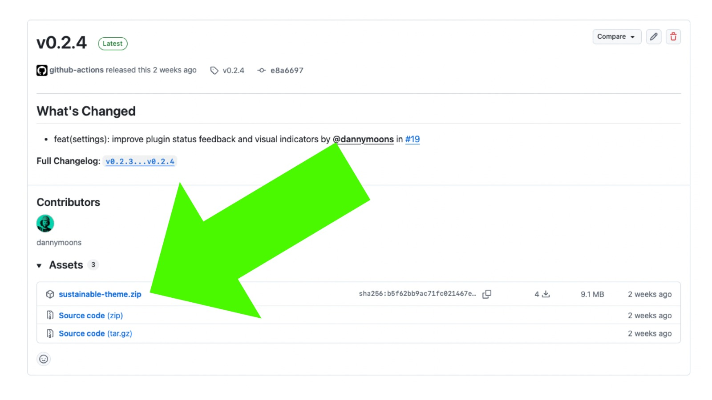

> Gebruik altijd het ZIP-bestand van een officiële release. Download je de volledige GitHub-repository, dan bevat deze ook bestanden die alleen bedoeld zijn voor developers.

## Stap 2 — Upload het thema

Log in op je WordPress-dashboard. Ga vervolgens naar:

**Weergave → Thema's → Nieuw thema toevoegen → Thema uploaden**

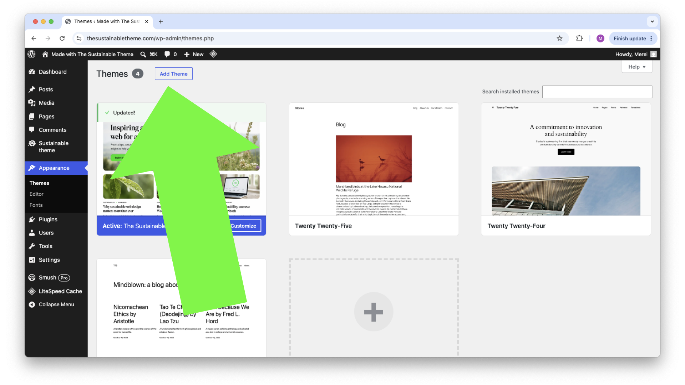

Selecteer het bestand `sustainable-theme.zip` en klik op **Nu installeren**. Na de installatie klik je op **Activeren**.

Kom je er niet uit? Op de website van WordPress vind je een uitgebreide uitleg over het installeren van thema's:

https://wordpress.org/documentation/article/work-with-themes/

## Stap 3 — Installeer de aanbevolen plugins

Na het activeren van het thema verschijnt bovenaan het dashboard een melding met aanbevolen plugins.

Deze plugins zijn niet verplicht, maar we raden sterk aan om ze meteen te installeren.

| Plugin | Waarom? |
|---------|----------|
| **Carbonfooter** | Meet de CO2 footprint van elke webpagina, met de optie om deze in de footer te tonen. |
| **Smush** | Verkleint afbeeldingen automatisch tijdens het uploaden. |
| **WP-Optimize** | Houdt WordPress schoon door oude revisies en tijdelijke bestanden op te ruimen. |
| **Autoptimize** | Verkleint en combineert CSS en JavaScript zodat je website minder bestanden hoeft te laden. |
| **LiteSpeed Cache** | Zorgt voor snellere laadtijden door pagina's te cachen. |

Klik op **Installeren** en activeer daarna de plugins.

Wil je weten hoe je een plugin installeert? Bekijk dan de officiële uitleg van WordPress:

https://wordpress.org/documentation/article/manage-plugins/

<!-- SCREENSHOT:
Suggested plugins melding
-->

## Stap 4 — Controleer de installatie

Ga terug naar het dashboard. Als de installatie gelukt is, zie je een nieuw menu-item: **Sustainable Theme**

Open daarna je website door linksboven over het huisje te hoveren en op **Bezoek site** te klikken.

Waarschijnlijk ziet je website er nog behoorlijk leeg uit. Dat is precies de bedoeling. In de volgende hoofdstukken gaan we stap voor stap je huisstijl instellen en beginnen we met bouwen.

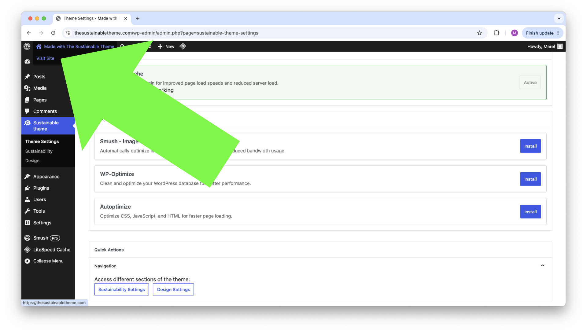

---
# 5. Je huisstijl instellen

Voordat we pagina's gaan bouwen, beginnen we met je huisstijl. Misschien niet het spannendste onderdeel, maar wel eentje waar je straks veel plezier van hebt. Zodra je kleuren, lettertypen en afstanden goed staan, vallen bijna alle patterns automatisch op hun plek. Je hoeft ze daarna meestal nog maar één keer in te stellen.

In dit hoofdstuk stellen we achter elkaar de **kleuren, lettertypen en spacing** van je website in. Dit doe je in de Editor. 

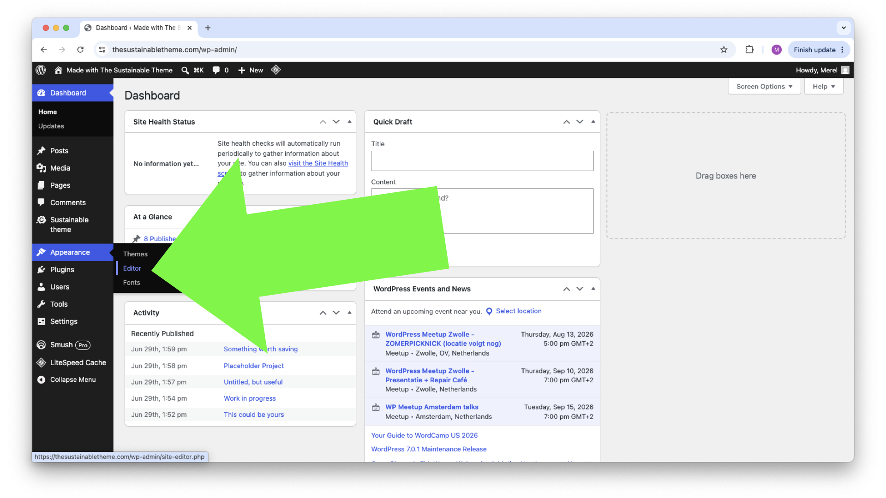

---

## Kleuren

The Sustainable Theme werkt met vaste kleurrollen. In plaats van iedere knop of achtergrond handmatig een kleur te geven, geef je eerst een aantal kleuren een vaste functie binnen je website (je kunt ze straks wel per onderdeel wijzigen, als je wilt). Daardoor blijft je ontwerp consistent. Verander je later één kleur, dan verandert deze automatisch overal waar die kleur wordt gebruikt.

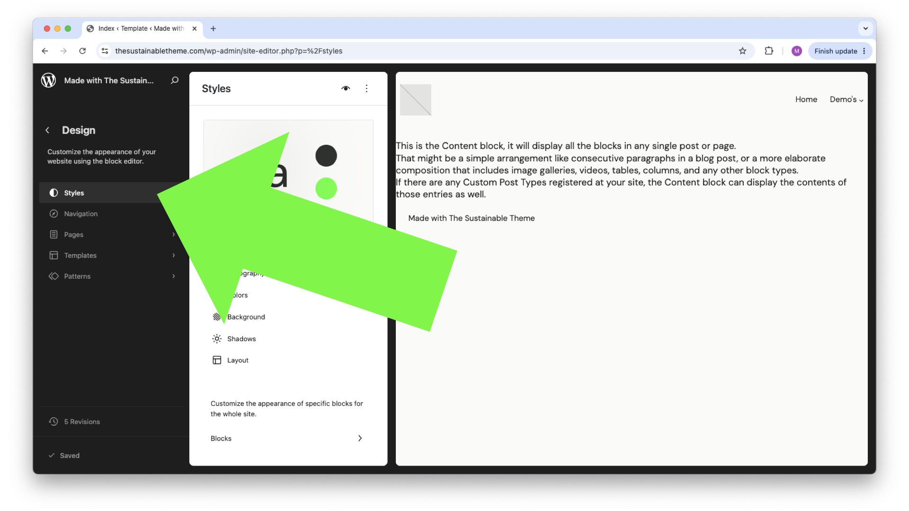

### De kleuren aanpassen

1. Ga naar **Weergave → Editor**.
2. Open **Styles**.
3. Kies **Colors**.
4. Open **Edit Palette**.
5. Pas de kleuren aan onder **Theme**, of kies één van de standaard kleurencombinaties.
6. Klik op **Save**.

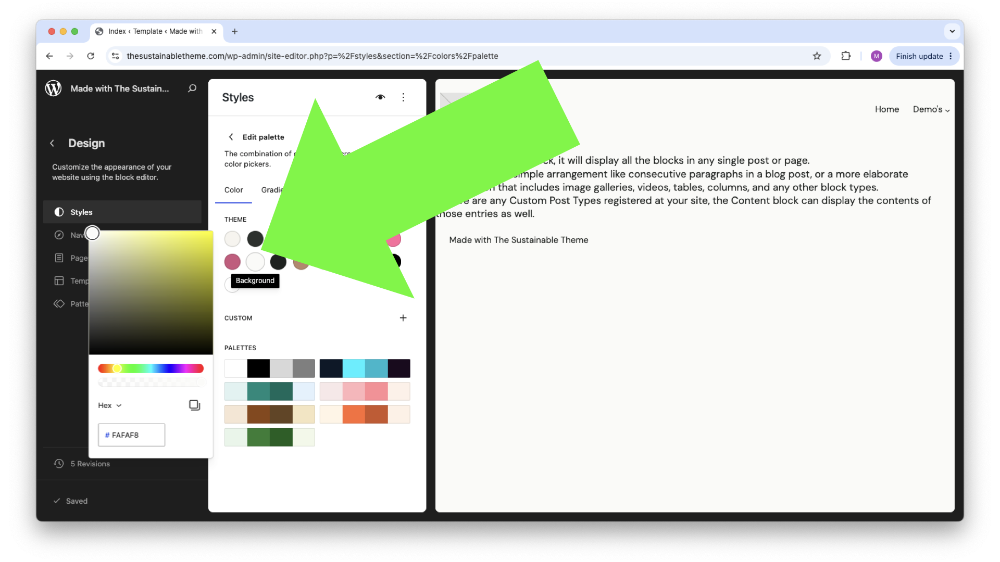

Wil je weten welk bolletje waar op je website iets aanpast? Het thema bevat acht kleurrollen.

| Kleur | Gebruik |
|--------|----------|
| Background | Achtergronden |
| Foreground | Standaard tekst |
| Primary | Belangrijkste accentkleur |
| Secondary | Tweede accentkleur |
| Tertiary | Extra accentkleur |
| Accent | Kleine highlights |
| Neutral 1 | Lichte vlakken en randen |
| Neutral 2 | Subtiele tekst en ondersteunende elementen |

Gebruik je liever maar twee kleuren? Dat kan ook. Kies dan alleen een **Background**- en **Foreground**-kleur. De overige kleuren kun je later altijd vervangen of laten verwijzen naar één van deze twee basiskleuren.

---

## Lettertypen

Typografie bepaalt voor een groot deel de uitstraling van je website. Je kunt ervoor kiezen om één lettertype voor alles te gebruiken, of een combinatie van twee lettertypen: één voor koppen en één voor lopende tekst.

Voor de meeste portfolio's raden we aan om het eenvoudig te houden. Dat is niet alleen rustiger, maar ook duurzamer: **ieder extra lettertype betekent namelijk een extra bestand dat bezoekers moeten downloaden.**

### Lettertypen toevoegen

1. Ga naar **Weergave → Editor**.
2. Open **Styles**.
3. Kies **Typography**.
4. Klik rechtsboven op het menu met de drie schuifjes.
5. Kies een font uit de **Font Library** (standaard staat DM Sans al geinstalleerd). Voor een ander font klik je het tabblad 'Upload' om up te loaden, of 'Install fonts' om een GoogleFont te installeren.

Een volgende stap is het juiste font en fontgrootte toewijzen aan verschillende tekststijlen. 

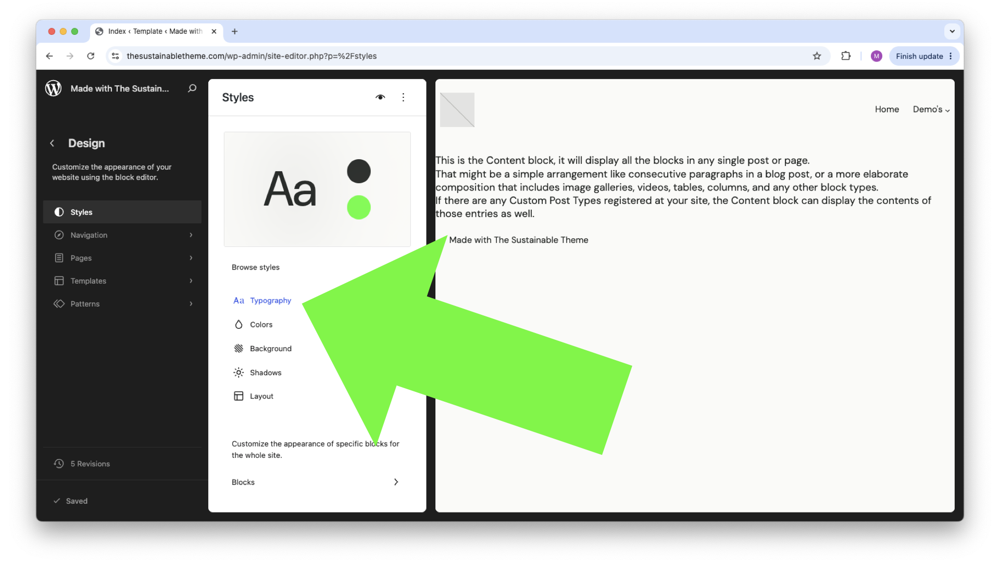
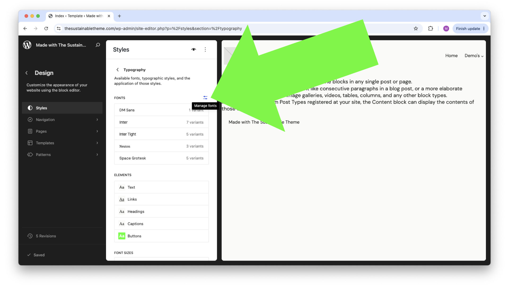
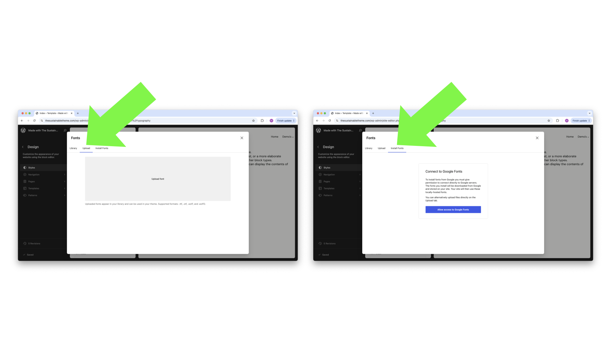

Meer uitleg over de Font Library vind je in de officiële WordPress-documentatie: https://wordpress.org/documentation/article/font-library/

<!-- TODO:
Artikel schrijven:
Welke fontformaten zijn het meest geschikt?
-->

### Welke instelling wordt waarvoor gebruikt?

| Instelling | Wordt gebruikt voor |
|------------|--------------------|
| Text | Alle gewone tekst |
| Headings | H1 t/m H6 |
| Links | Alle hyperlinks |
| Captions | Afbeeldingsonderschriften |
| Buttons | Tekst in knoppen |

Welke heading waar wordt gebruikt is grotendeels een kwestie van uitproberen. Je kunt ook in een nieuw tabblad je website openen, tekst selecteren en met een rechtermuisklik op 'inspect' klikken. 
Bijvoorbeeld: 

| Tekst | Gebruikte heading |
|------------|--------------------|
| Grote tekst home | H1 |
| Titels projecten | H3 |
| Onderschriften projecten | Gewone tekst |
| Uitnodiging onderaan pagina | H2 |

> Zie je andere instellingen? Dat kan. WordPress blijft de Site Editor verder ontwikkelen waardoor sommige onderdelen per versie kunnen verschillen.

<!-- TODO:
Controleren welke typography presets het theme precies gebruikt.
-->

### Lettergroottes

Het thema bevat een vaste schaal met lettergroottes die je zelf kan aanpassen. Deze zijn zo gekozen dat koppen, tussenkoppen en lopende tekst automatisch goed met elkaar in verhouding blijven.

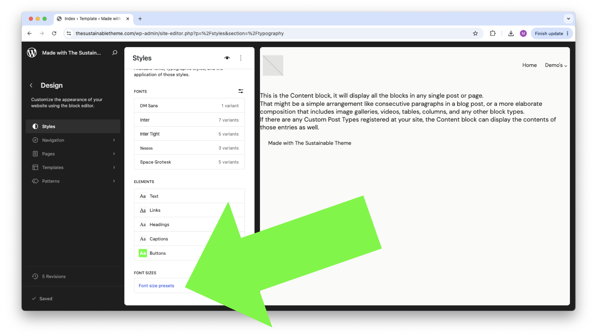
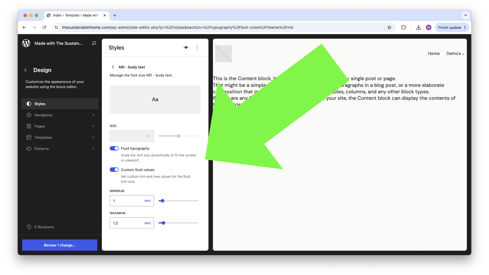

Alle lettergroottes zijn bovendien *fluid*. Dat betekent dat ze automatisch meeschalen tussen mobiel en desktop. Je hoeft hiervoor geen aparte instellingen te maken. Je kunt kiezen of je je fontgroottes instelt in pixels, REM, EM, vw of hw. Pixelgroottes staan vast, de andere maten zijn relatief. Twijfel je? Dan raden we aan om te kiezen voor REM, mocht een slechtziende bezoeker dan bijvoorbeeld gebruik maken van tekstvergrotingssoftware, dan schaalt de tekst automatisch mee. 

**En tip; 1 REM is 16 pixels, en dat is de standaard grootte van 'gewone' bodycopy tekst!**

---

## Spacing

Spacing is de ruimte tussen elementen op je website. Per blok of element kan je zelf kiezen hoeveel ruimte je eromheen wilt hebben. 

Goede spacing zorgt ervoor dat een pagina rustig leest en prettig aanvoelt. Daarom gebruikt The Sustainable Theme een vaste set afstanden die overal terugkomt. Net als de lettergroottes zijn deze afstanden *fluid*: op een groot scherm worden ze iets groter, op een klein scherm juist iets kleiner.

In de meeste gevallen hoef je deze instellingen helemaal niet aan te passen.

Gebruik je later extra padding of margins op een blok? Kies dan altijd één van de standaard spacing-waardes. Zo blijft je hele website mooi in balans.

<!-- SCREENSHOT:
Styles → Spacing
-->

## Ronde hoeken instellen

Naast kleuren, lettertypen en spacing kun je ook de uitstraling van je website bepalen met de ronding van afbeeldingen, kaarten en knoppen.

Ga naar:

**Sustainable Theme → Design Settings**

Hier kun je drie waarden aanpassen:

- **Card Radius** – de ronding van kaarten en containers;
- **Image Radius** – de ronding van afbeeldingen;
- **Button Radius** – de ronding van knoppen.

De wijzigingen worden automatisch overal in je website toegepast. Zo geef je je hele portfolio met één instelling een zachtere of juist strakkere uitstraling.

# 6. Je eerste projectpagina

Nu je huisstijl staat, gaan we eindelijk beginnen met bouwen. We beginnen *niet* met de homepage.

Waarom niet?

Omdat je homepage straks gevuld wordt met je projecten. Als die projecten er nog niet zijn, bouw je eigenlijk om lege content heen. Daarom maken we eerst een goede projectpagina. Daarna kun je dezelfde opzet gebruiken voor al je andere projecten. Heb je straks minimaal 3, maar liefst zes projecten toegevoegd? Dan heb je genoeg content om een mooie homepage te maken.

## Posts en pagina's

WordPress maakt onderscheid tussen **Posts** en **Pages**.

Binnen The Sustainable Theme gebruiken we:

- **Posts** gebruik je voor projecten in je portfolio.
- **Pagina's** gebruik je voor vaste pagina's, zoals Over mij of Contact.

Het thema zorgt er vervolgens automatisch voor dat je projecten op de juiste plekken verschijnen.

Meer weten over het verschil?

https://wordpress.org/documentation/article/posts-vs-pages/

---

## Een nieuw project maken

1. Ga naar **Posts**.
2. Klik op **Nieuwe post**.
3. Geef je project een titel.

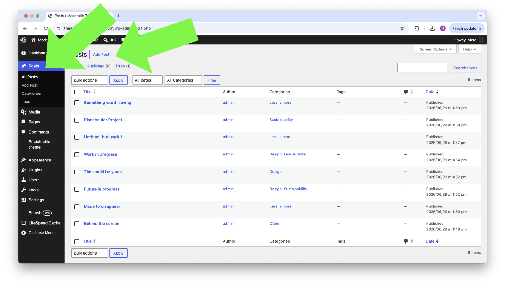

Publiceer de pagina nog niet. Eerst voegen we een layout toe.

## Een pattern toevoegen

Een pattern is een kant-en-klare pagina-indeling die je als startpunt gebruikt. Je hoeft dus niet iedere pagina helemaal vanaf nul op te bouwen. Klik linksboven op het **+**-icoon.

Open daarna het tabblad **Patterns**.

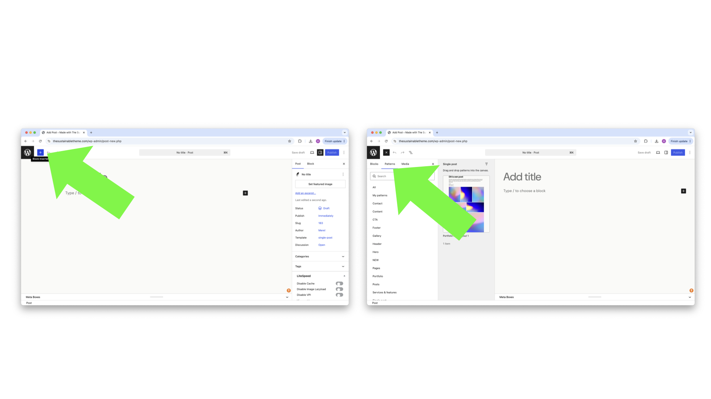

Het thema bevat meer dan 75 patterns. Je ziet alleen de patterns van The Sustainable Theme — de standaard WordPress-patterns en patterns uit de online bibliotheek staan uit, zodat je overzicht houdt.

De patterns zijn gegroepeerd in categorieën. De nummers vooraan helpen je snel de juiste groep te vinden:

| Categorie | Wat vind je hier? |
| --- | --- |
| **00 — Single Post Layout** | Complete layouts voor een projectpagina (zichtbaar bij Posts) |
| **Single post** | Losse onderdelen voor een project: hero's, credits |
| **00 Pages** | Alle complete pagina-layouts bij elkaar |
| **10 Pages — Portfolio** | Complete pagina's voor een portfolio (Home, About, Work, Contact) |
| **20 Pages — Agency** | Complete pagina's voor een agency- of bedrijfswebsite |
| **Hero**, **Content**, **Gallery**, **Posts & projects**, **Services & pricing**, **Call to action**, **Contact** | Losse secties die je kunt combineren |
| **Header**, **Footer** | Site-onderdelen (meestal via de Site Editor) |

Belangrijk: WordPress toont patterns die bij het type inhoud passen. Bewerk je een **Post** (project), dan zie je vooral de Single Post-layouts en -secties. Bewerk je een **Page**, dan zie je de complete pagina-layouts en de losse secties voor pagina's.

Kies voor je eerste project een complete layout. Open de categorie **00 — Single Post Layout** en kies:

**Single post — Portfolio layout 01**

Dat is een kant-en-klare projectpagina met intro, credits en galerijen. Maak je geen zorgen over kleuren, afbeeldingen of teksten. Die gaan we nu vervangen.

Wil je liever zelf opbouwen? Kies dan onderdelen uit **Single post** (bijvoorbeeld een hero) en vul daarna aan met galerijen of content-secties.

## Werken met de List View

Sommige patterns bestaan uit tientallen blokken. Dat kan in het begin wat overweldigend zijn.

Gelukkig heeft WordPress de **List View**.

Open linksboven het icoon met de drie horizontale streepjes. Hier zie je alle onderdelen van de pagina overzichtelijk onder elkaar. Vanuit de List View kun je eenvoudig een specifiek blok selecteren, ook als het op de pagina lastig aanklikbaar is.

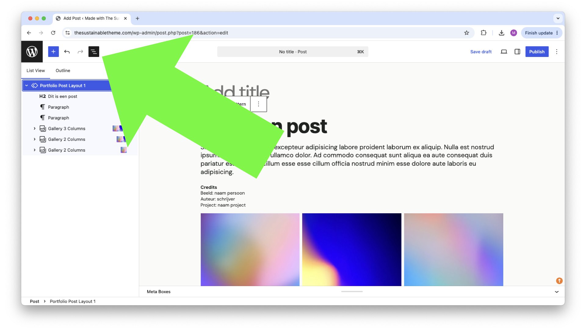

Je zult merken dat je deze weergave al snel vaker gebruikt dan de pagina zelf. 

## Een pattern aanpassen

Je kunt alles aanpassen wat je ziet. Een pattern is alleen het startpunt; daarna wordt het jouw eigen ontwerp. Klik in de List View op het pattern dat je hebt toegevoegd. Je ziet nu een paarse rand om het volledige pattern verschijnen. Boven het pattern verschijnt een knop **Edit Pattern**.

Klik hierop.

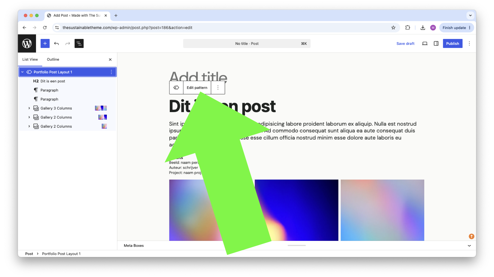

Je werkt nu in de Pattern Editor. Hier kun je de inhoud van het pattern aanpassen, zoals teksten, afbeeldingen en de volgorde van blokken.

Wanneer je klaar bent, klik je linksboven op **Back** om terug te gaan naar je projectpagina. Maak je geen zorgen: je blijft gewoon werken aan deze projectpagina. Je hoeft niets opnieuw toe te voegen.

## De editor verkennen

Wanneer je een blok selecteert, verschijnen er twee plekken waar je instellingen kunt aanpassen.

### De toolbar

Direct boven het geselecteerde blok verschijnt een kleine werkbalk met de meest gebruikte acties, zoals uitlijnen, dupliceren of een blok verplaatsen.

### De rechterzijbalk

Vrijwel alle instellingen van een blok vind je in de rechterzijbalk. Zie je deze niet? Klik dan rechtsboven op het instellingen-icoon om de zijbalk te openen.

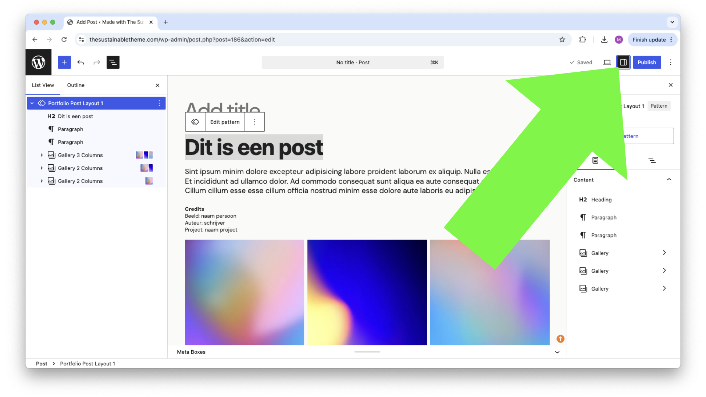

In de rechterzijbalk zie je verschillende tabbladen. Welke je ziet, hangt af van het type blok dat je hebt geselecteerd.

Bij een afbeelding zie je bijvoorbeeld instellingen voor de afbeelding zelf, terwijl je bij een tekstblok instellingen ziet voor typografie en kleuren.

Raak niet ontmoedigd door alle opties. In deze handleiding gebruiken we alleen de instellingen die je op dat moment nodig hebt.

Let op; welke opties je te zien krijgt in het rechtermenu hangt samen met welk onderdeel je in je List View hebt geselecteerd. Hier zit een hierarchie in. Zo stel je bijvoorbeeld in een Column in wat de 'regels' voor die column zijn, maar door specifiek een Paragraph blok aan te klikken kan je alles instellen voor alleen dat ene blok. 

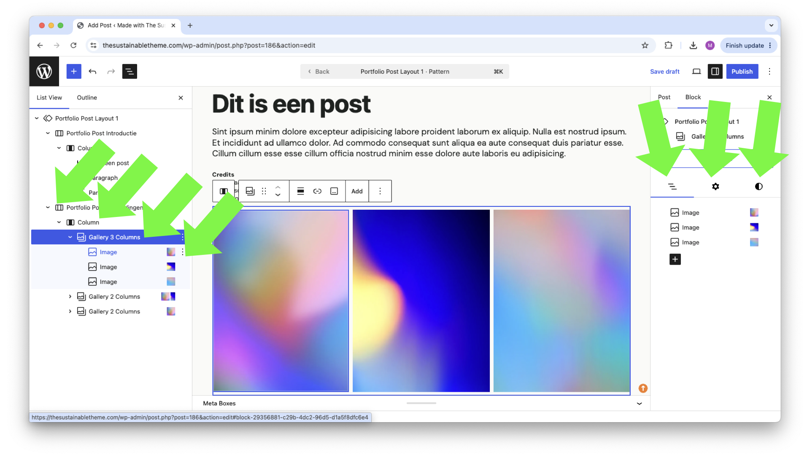

## Tekst aanpassen

Klik op een tekstblok en vervang de voorbeeldtekst door je eigen content. Je kunt direct typen of bestaande tekst selecteren en overschrijven.

Gebruik de toolbar boven het blok voor veelgebruikte opties, zoals uitlijning of een link toevoegen. Meer instellingen, zoals tekstkleur en typografie, vind je in de rechterzijbalk.

## Afbeeldingen vervangen

Klik op een afbeelding en kies **Replace** in de toolbar. Je kunt een nieuwe afbeelding uploaden of een bestaande afbeelding uit de mediabibliotheek kiezen.

In de rechterzijbalk vind je extra instellingen, zoals de beeldverhouding, afgeronde hoeken en alt-tekst.

Let op dat je echt de afbeelding hebt geselecteerd (en niet de hele gallery).

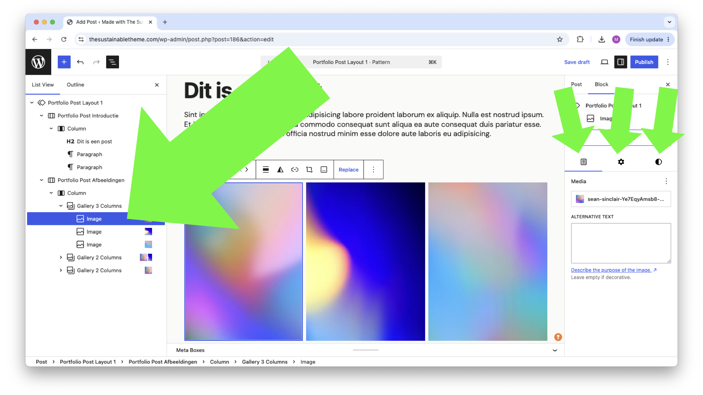

In de praktische handleidingen lees je later meer over afbeeldingsformaten, uitsneden en Featured Images.

<!-- TODO:
Verwijzen naar hoofdstuk Afbeeldingen.
-->

## Een blok toevoegen

Wil je extra tekst, een afbeelding of een ander onderdeel toevoegen? Klik op het **+**-icoon tussen twee bestaande blokken of linksboven in de editor. Zoek vervolgens naar het gewenste blok of kies één van de patterns uit de bibliotheek.

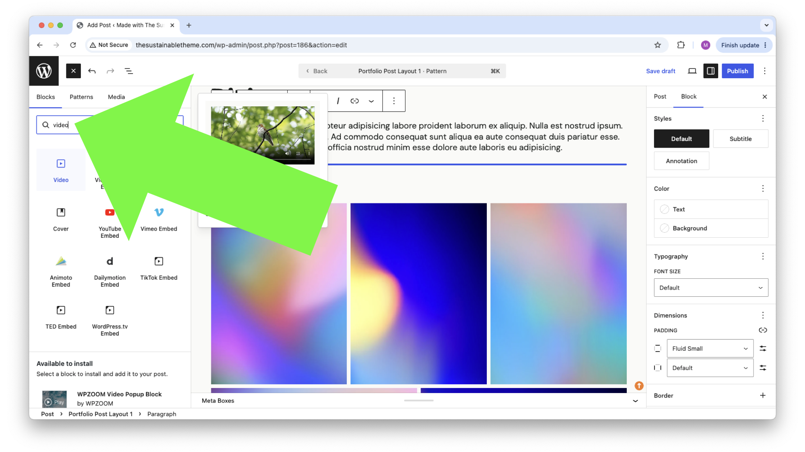

Tip: voeg eerste een Column blok toe, en pas daarbinnen je content blok (zoals een afbeelding, tekst of video). Een column blok zorgt ervoor dat je losse content blokken niet gaan 'zweven' of buiten de marges vallen. 

Kijk weer in je List-view waar het blok terecht is gekomen. Sleep 'm dan naar de juiste plek. 

Je kunt natuurlijk ook bestaande blokken kopiëren of dupliceren als je een vergelijkbare opmaak wilt gebruiken.
Wil je bijvoorbeeld een extra tekstblok toevoegen? Typ dan 'Paragraph' in. Een video blok voeg je toe door te zoeken op 'Video'. 

## Breedte van een blok aanpassen

Veel blokken kun je breder of smaller maken. Selecteer een blok en kijk in de toolbar boven het blok. Hier kun je vaak kiezen uit verschillende uitlijningen, zoals **Wide width** of **Full width**.

Niet ieder blok ondersteunt dezelfde opties. Welke instellingen je ziet, hangt af van het geselecteerde blok. Zie daarom ook de tip hierboven om inhoud altijd in een 1-Column blok (of group) te plaatsen!

## Een Featured Image instellen

Elke projectpagina heeft een **Featured Image**.

Deze afbeelding wordt gebruikt op verschillende plekken in je website, bijvoorbeeld in projectoverzichten op de homepage of als je een link deelt via sociale media. Open de instellingen van de pagina in de rechterzijbalk en kies **Featured Image**. 

Upload vervolgens een afbeelding die jouw project goed samenvat, of kies er een uit je media library.

Let op; als je geen featured image instelt is je project ook niet zichtbaar op de homepagina. 

## Je eigen pattern opslaan

Ben je tevreden over de opbouw van je project? Dan kun je deze bewaren als een eigen pattern. Zo hoef je bij je volgende projecten niet steeds opnieuw dezelfde layout op te bouwen of dezelfde wijzigingen door te voeren.
Gebruik dit vooral voor onderdelen die je vaker wilt gebruiken. Zo bouw je stap voor stap je eigen bibliotheek met layouts op.

### Een pattern maken

1. Selecteer alle blokken die je wilt opslaan in je List View.
2. Klik op de drie puntjes in de toolbar.
3. Kies **Create pattern**.
4. Geef je pattern een duidelijke naam, bijvoorbeeld **Project Layout**.
5. Voeg eventueel een categorie toe (bijv. Project layouts)
6. Let op dat het vinkje 'Synced' UIT staat.
7. Sla het pattern op.

Je eigen pattern verschijnt nu automatisch tussen de patterns in de bibliotheek.

Wanneer je een nieuw project maakt, hoef je alleen nog maar dit pattern toe te voegen. Daarna vervang je de teksten en afbeeldingen door de content van je nieuwe project. Zo blijft de opbouw van je portfolio consistent en bespaar je jezelf veel werk.

## Maak nu nog een paar projecten

Je eerste project is klaar. Gebruik nu dezelfde werkwijze om nog een aantal projecten toe te voegen. Wij raden aan om minimaal vijf of zes projecten toe te voegen voordat je verdergaat. Zo heb je straks genoeg content om een mooie homepage en projectoverzichten te bouwen.

In het volgende hoofdstuk gaan we precies dat doen.

# 7. Je homepage bouwen

Je hebt nu een aantal projecten toegevoegd. Tijd om ze een mooi podium te geven. In dit hoofdstuk bouwen we een eenvoudige homepage met een introductie en een overzicht van je projecten.

Later kun je deze natuurlijk helemaal aanpassen aan je eigen stijl.

## Een nieuwe homepage aanmaken

Ga naar **Pages → Add New Page**.

Geef de pagina de titel **Home**. Publiceer de pagina nog niet. Klik linksboven op het **+**-icoon en open het tabblad **Patterns**.

Kies vervolgens een pattern uit de categorie **10 Pages — Portfolio**. Net als bij de projectpagina's begin je met een complete layout die je daarna helemaal kunt aanpassen. Voor een portfolio-homepage past bijvoorbeeld **Home 01**, **Home 02** of **Home 03**.

Liever zelf samenstellen? Combineer dan losse secties, bijvoorbeeld **Hero — Split text** en daaronder **Posts — Masonry 3 columns** uit de categorieën **Hero** en **Posts & projects**.

Nu kun je aan de slag met inhoud toepassen, net zoals je dit bij je projectposts deed. 

## Je projecten verschijnen automatisch

Het projectoverzicht op de homepage maakt gebruik van de projecten die je eerder hebt aangemaakt.

Publiceer je een nieuw project? Dan verschijnt het automatisch in het overzicht.

Je hoeft projecten dus niet handmatig aan de homepage toe te voegen.

## De volgorde van projecten wijzigen

Standaard worden de nieuwste projecten als eerste weergegeven.

Wil je een andere volgorde?

Dan kun je de publicatiedatum aanpassen. Dat doe je zo:
1. Ga in je Wordpress dashboard naar Posts
2. Hover over de titel van een post, dan verschijnt een snelmenu.
3. Klik op 'Quick Edit'
4. Pas de publicatiedatum van je project aan.

Nieuwste projecten staan bovenaan. Let op; als je een masonry layout hebt gekozen voor je homepagina, dan lopen de blokken per rij van links naar rechts, van boven naar onder.  

Hier kan je ook direct comments en pings uitzetten (als je dat wilt), en een categorie toewijzen. Daarover later meer! 

## Het projectoverzicht aanpassen

De homepage bevat een projectoverzicht waarin bezoekers direct een selectie van je werk zien.
In het linkermenu (List View) kun je onderdelen toevoegen of verwijderen. Let op dat je in de goede 'laag' werkt. Zo kun je hier bijvoorbeeld de 'excerpt' verwijderen, waardoor je enkel nog een titel ziet staan. 

In het rechtermenu kun je per onderdeel de instellingen wijzigen. Bijvoorbeeld de witruimte tussen de projecten, of de tekstgrootte van je titels. 

Wil je de hoeveelheid kolommen of de verhouding van de afbeeldingen op je homepage veranderen? 
Klik op 'Edit Pattern' en ga naar de laag getiteld 'Post Template'. Hier kan je het aantal kolommen wijzigen. 
Let op: bij layouts met masonry blokken is het niet mogelijk om het aantal kolommen te wijzigen, kies dan direct het pattern met het juiste aantal kolommen. 

Wil je de verhouding van alle featured images op je home wijzigen? Ga dan in je List view naar 'Featured image' en kies rechts bij 'Aspect Ratio' voor een andere maat. 

## De homepage verder uitbreiden

Natuurlijk hoeft je homepage niet alleen uit projecten te bestaan.

Je kunt bijvoorbeeld extra onderdelen toevoegen, zoals:

- een korte bio;
- een lijst met opdrachtgevers;
- een selectie van diensten;
- testimonials;
- een call-to-action;
- een contactblok.

Net als bij je projectpagina's kun je hiervoor gebruikmaken van de patterns die zijn meegeleverd met het thema.

Klik op het **+**-icoon, open **Patterns** en kies de patterns of blokken die je wilt.  

# 8. Andere pagina's toevoegen

Je homepage en projectpagina's staan. Nu kun je de rest van je website gaan vullen.

Denk bijvoorbeeld aan een About, Contact of CV pagina. De werkwijze is steeds hetzelfde: maak een nieuwe pagina, kies een pattern en pas de inhoud aan.

## Een nieuwe pagina maken

Ga naar **Pages → Add New Page**.

Geef de pagina een titel, bijvoorbeeld **About** of **Contact**.

Publiceer de pagina nog niet. Eerst voegen we een layout toe.

## Een layout toevoegen

Klik linksboven op het **+**-icoon en open het tabblad **Patterns**.

Kies een complete pagina uit **10 Pages — Portfolio** (of **20 Pages — Agency** als je een meer zakelijke site bouwt). Voor een portfolio zijn dit handige startpunten:

- **About 01** of **About 02** — over-ons pagina;
- **Work 01** — overzicht van je projecten;
- **Contact 01** of **Contact 02** — contactpagina;
- **Blog 01** — blog- of nieuws-overzicht (onder Agency).

Je kunt ook meerdere losse patterns en blokken combineren. Alle complete pagina-layouts staan ook bij elkaar in **00 Pages**.

## De inhoud aanpassen

Klik op **Edit Pattern** om het pattern te bewerken. Vervang vervolgens de voorbeeldteksten en afbeeldingen door je eigen content. Net als bij de projectpagina's kun je blokken toevoegen, verwijderen, verplaatsen of aanpassen via de toolbar en de rechterzijbalk.

## De pagina publiceren

Ben je tevreden met het resultaat? Klik dan rechtsboven op **Publish**. Herhaal deze stappen voor iedere nieuwe pagina die je aan je website wilt toevoegen.

In het volgende hoofdstuk gaan we de verschillende pagina's met elkaar verbinden door een navigatiemenu toe te voegen.

# 9. Header, footer en navigatie

Je website begint inmiddels echt vorm te krijgen. Nu is het tijd om de verschillende pagina's met elkaar te verbinden, zodat bezoekers eenvoudig door je portfolio kunnen navigeren.

In dit hoofdstuk passen we de header en footer aan en maken we een navigatiemenu.

## De header bewerken

Ga naar **Appearance → Editor**. Klik vervolgens links op **Patterns** en open de **Header**.

Klik op **Edit** om het pattern te bewerken. Hier kun je ook weer gebruik maken van de List View door op het menu met drie streepjes linksboven te klikken. 

## Een logo toevoegen

Selecteer het Site Logo-blok. Klik op **Replace** en upload je logo. Heb je nog geen logo? Dan kun je voorlopig ook gewoon de naam van je studio of je eigen naam gebruiken.

## Het navigatiemenu aanpassen

Selecteer het Menu-blok. Klik vervolgens op **Edit**. Je kunt nu pagina's toevoegen, verwijderen of de volgorde aanpassen.

## De footer aanpassen

Ga weer naar Patterns, en open vervolgens het **Footer** pattern.

Hier kun je bijvoorbeeld aanpassen:

- je naam of studionaam;
- copyrighttekst;
- e-mailadres;
- social media;
- een korte afsluitende tekst.

Net als bij alle andere patterns kun je ook hier blokken toevoegen, verwijderen of verplaatsen.

## Site title en tagline
Er zijn ook nog wat standaard dingen die je moet instellen voor je live kan. Ga naar:

**Settings → General**

Kies een Titel en Tagline, dit zijn bijvoorbeeld de dingen die mensen zien als je website in een Google search verschijnt. 

## Favicon instellen

Een favicon is het kleine icoontje dat verschijnt in het tabblad van de browser. Die maak je natuurlijk ook 'eigen'!

Ga naar:

**Settings → General → Site Icon**

Upload vervolgens een vierkante afbeelding van minimaal **512 × 512 pixels**.

In het volgende hoofdstuk lopen we samen nog één keer alles na voordat je website live gaat.

# 10. Klaar om live te gaan

Gefeliciteerd! Je website is klaar. Voordat je hem deelt, is het slim om nog één keer te controleren of alles klopt.

Je website heeft nu:

- een homepage;
- meerdere projectpagina's;
- extra pagina's;
- een navigatiemenu;
- een header;
- een footer;
- en zelfs een favicon
  
Loop bijvoorbeeld na of:

- alle pagina's de juiste inhoud bevatten;
- alle links werken;
- je navigatiemenu compleet is;
- je afbeeldingen zijn vervangen;
- je website er goed uitziet op mobiel.

Ben je tevreden? Dan is het tijd om je website live te zetten.

Veel plezier met je nieuwe duurzame website!

# Praktische handleidingen

Gefeliciteerd! Je portfolio staat live.

Misschien wil je nu video's toevoegen, projecten filteren of de duurzaamheidsinstellingen verder aanpassen. In deze handleidingen leggen we een aantal functies uit die je minder vaak gebruikt, maar waarmee je nog meer uit The Sustainable Theme haalt.

Je hoeft deze handleidingen niet op volgorde te lezen. Gebruik ze als naslagwerk wanneer je een specifieke functie nodig hebt.

<!-- VANAF HIER DEEL 2 
O.a.
- Media toevoegen
  - video
  - PDF
  - audiobestand
  - Een header afbeelding instellen

- Belangrijkste verschillen Groups, Columns en Blocks

- Extra features toevoegen
  - Portfolio categorieën en homepagina filter 
  - Next posts instellen 
  - weergave mobiel versus desktop instellen

- Duurzaamheidsinstellingen thema
  - switches
  - Grid Aware
  - Database opruimen(?) 

- Instellen carbonfooter plugin

- Updates

- FAQ

-->

<!-- Stukken tekst die misschien nog handig zijn om ergens te verwerken -->

### Group (Groep)

**Wat het is:** Een container die andere blokken omhult. Gebruik het als sectie-wrapper om achtergrondkleur, padding, en uitlijning toe te passen op een hele sectie.

**Hoe het gebruikt wordt in dit thema:** Vrijwel elke sectie in een pattern is een Group-blok. Het Group-blok bepaalt de breedte, de achtergrondkleur, en de verticale ruimte van een sectie.

[→ WordPress-documentatie: Group](https://wordpress.org/documentation/article/group/)

---

### Columns & Column

**Wat het is:** Verdeelt de inhoud in meerdere naast elkaar staande kolommen.

**Hoe het gebruikt wordt:** Diensten naast elkaar, tekst naast afbeelding, portfolio-grid — al deze lay-outs gebruiken Columns.

[→ WordPress-documentatie: Columns](https://wordpress.org/documentation/article/columns/)

---

### Heading (Koptekst)

**Wat het is:** Koppen van niveau H1 t/m H6.

**Hoe het gebruikt wordt:** In dit thema zijn er stijlvarianten voor headings:
- **Subtitle** — voor ondertitels van secties
- **Display** — voor grote titels die enorm uit de verf moeten komen
- **Annotation** — voor kleine annotaties of labels

Kies een variant via het zijpaneel → **Stijlen** na het selecteren van een heading.

[→ WordPress-documentatie: Heading](https://wordpress.org/documentation/article/heading/)

---

### Paragraph (Alinea)

**Wat het is:** Standaard lopende tekst.

**Hoe het gebruikt wordt:** Alle bodytekst. Ook de **Subtitle** en **Annotation** stijlvarianten zijn beschikbaar op alinea's, niet alleen op headings.

[→ WordPress-documentatie: Paragraph](https://wordpress.org/documentation/article/paragraph/)

---

### Image (Afbeelding)

**Wat het is:** Voegt een afbeelding in vanuit de mediabibliotheek of externe URL.

**Hoe het gebruikt wordt:** In portfolio-kaarten, naast tekst in content-secties, in galerijen. De ronding van afbeeldingen volgt automatisch de **Image radius** die je in Design Settings hebt ingesteld.

[→ WordPress-documentatie: Image](https://wordpress.org/documentation/article/image/)

---

### Cover

**Wat het is:** Een afbeelding of video als achtergrond, met inhoud eroverheen.

**Hoe het gebruikt wordt:** Hero-secties, grote intro-secties met overlay. Dit is het meest impactvolle blok voor een sterke openingsindruk.

[→ WordPress-documentatie: Cover](https://wordpress.org/documentation/article/cover/)

---

### Buttons & Button

**Wat het is:** Klikbare knoppen.

**Hoe het gebruikt wordt:** Call-to-action knoppen onderaan secties. Het thema heeft twee knopstijlen:
- **Standaard** (gevuld) — gebruikt de Secondary-kleur als achtergrond
- **Outline** — transparante knop met rand, voor een secundaire actie naast een gevulde knop

[→ WordPress-documentatie: Buttons](https://wordpress.org/documentation/article/buttons/)

---

### Navigation (Navigatie)

**Wat het is:** Het navigatiemenu van je site.

**Hoe het gebruikt wordt:** Altijd in de header-template. Je maakt je menustructuur aan via de Site Editor → Header → klik op het Navigatie-blok.

> **Eerste keer instellen:** Klik op het Navigatie-blok in de header → voeg paginalinks toe. WordPress slaat je menu automatisch op.

[→ WordPress-documentatie: Navigation](https://wordpress.org/documentation/article/navigation/)

---

### Site Logo

**Wat het is:** Het logo van je website, zoals ingesteld in de WordPress-instellingen.

**Hoe het gebruikt wordt:** In alle header-patterns. Upload je logo via **Weergave → Editor → Header → klik op het logo-blok**.

[→ WordPress-documentatie: Site Logo](https://wordpress.org/documentation/article/site-logo/)

---

### Query Loop

**Wat het is:** Een automatisch bijgewerkt overzicht van berichten, gefilterd op categorie, tag, datum, etc.

**Hoe het gebruikt wordt:** Alle patterns in de categorie **Posts & projects** gebruiken een Query Loop. Je stelt in welke berichten worden getoond en hoe ze eruitzien.

**Thema-uitbreiding:** Het thema voegt een extra optie toe aan de Query Loop: **"Huidige post uitsluiten"**. Als je een gerelateerde posts-sectie op een blogbericht-pagina zet, zorgt deze optie dat het bericht dat je op dit moment leest, niet in de lijst verschijnt.

[→ WordPress-documentatie: Query Loop](https://wordpress.org/documentation/article/query-loop-block/)

---

### Gallery (Galerij)

**Wat het is:** Een grid van meerdere afbeeldingen tegelijk.

**Hoe het gebruikt wordt:** In portfolio- en galerij-secties. Het thema heeft ook masonry-patronen die de gallery visueel vrijer maken.

[→ WordPress-documentatie: Gallery](https://wordpress.org/documentation/article/gallery/)

---

### Quote (Citaat)

**Wat het is:** Een opgemaakt citaat.

**Hoe het gebruikt wordt:** Voor testimonials, klantcitaten, en opvallende uitspraken binnen een pagina.

[→ WordPress-documentatie: Quote](https://wordpress.org/documentation/article/quote/)

---

### List (Lijst)

**Wat het is:** Opsomming met bullets of nummers.

**Hoe het gebruikt wordt:** In prijzensecties (features per abonnement), in dienstenpagina's.

[→ WordPress-documentatie: List](https://wordpress.org/documentation/article/list/)

---

### Separator (Scheidingslijn)

**Wat het is:** Een horizontale lijn om secties van elkaar te scheiden.

**Thema-stijlen:**
- **1px content-breedte** — subtiele lijn binnen de content-breedte
- **2px smal** — iets prominenter, smaller
- **4px volledig** — brede, opvallende lijn over de volledige breedte

[→ WordPress-documentatie: Separator](https://wordpress.org/documentation/article/separator/)

---

### Post Featured Image, Post Title, Post Date, Post Excerpt

Deze vier blokken zijn **context-afhankelijk**: ze werken alleen binnen een Query Loop of op een enkel-bericht-template. Ze halen automatisch de gegevens op van het bericht dat op dat moment wordt weergegeven.

| Blok | Haalt op |
|------|---------|
| **Post Featured Image** | De uitgelichte afbeelding van het bericht |
| **Post Title** | De titel van het bericht |
| **Post Date** | De publicatiedatum |
| **Post Excerpt** | De samenvatting van het bericht |

**Thema-uitbreiding:** Het thema voegt een optie toe aan het Post Excerpt-blok: **"Lees meer-link verbergen"**. Zo toon je alleen de samenvatting, zonder de automatische "Lees meer"-knop eronder.

---

## 14. Duurzaamheidsinstellingen

Ga naar **Sustainable Theme → Sustainability** om de duurzaamheidsinstellingen te configureren.

### De drie modi

#### Base Mode — aanbevolen voor de meeste sites

Dit is de standaardinstelling. Veilig voor alle sites, inclusief webshops. Wat het doet:

- Emoji-scripts verwijderd (bespaart laadtijd)
- Oembed-embeds uitgeschakeld (geen auto-preview van YouTube etc. in berichten)
- WordPress-headerrommeltje opgeruimd
- jQuery Migrate uitgeschakeld
- Kortlinks uitgeschakeld
- Post-revisies beperkt tot 5
- Query strings van CSS/JS-bestanden verwijderd (betere caching)
- Bestandsbewerking in dashboard uitgeschakeld (veiliger)
- Lazy loading aan (2 afbeeldingen boven de vouw laden direct)
- Afbeeldingsoptimalisatie aan
- Video-autoplay uitgeschakeld

#### Super Mode — voor blogs en contentwebsites

Alles van Base Mode, plus:

- Scripts verwijderd die niet nodig zijn
- RSS-feeds uitgeschakeld
- REST-links uit de header verwijderd
- XML-RPC uitgeschakeld
- WordPress Heartbeat uitgeschakeld
- Reactiessysteem uitgeschakeld
- WordPress-versienummer verborgen
- DNS-prefetch uitgeschakeld
- Dashicons op de frontend uitgeschakeld
- Gravatar vervangen door een lichte SVG-placeholder
- Automatische updates uitgeschakeld
- Revisies beperkt tot 3
- Standaard WordPress-afbeeldingsgroottes verwijderd

> **Let op:** Super Mode schakelt Reacties volledig uit. Gebruik Base Mode als je reacties op je blog wilt bijhouden.

#### Custom Mode — voor gevorderden

Met Custom Mode zet je elke individuele instelling aan of uit. Handig als je de meeste Base Mode-instellingen wilt, maar bijv. RSS-feeds wél nodig hebt.

### Welke modus kies ik?

| Type website | Aanbevolen modus |
|-------------|-----------------|
| Portfolio, visitekaartje | Super Mode |
| Blog met reacties | Base Mode |
| Webshop | Base Mode |
| Zakelijke website | Base Mode of Super Mode |
| Persoonlijk project | Super Mode |

---

## 15. Grid Awareness — real-time koolstofmeting

Dit is een geavanceerde optionele functie. Met **Grid Awareness** monitort je site in realtime de CO₂-intensiteit van het lokale elektriciteitsnet. Op momenten dat het net meer op hernieuwbare energie draait, kan de site dit aan bezoekers laten zien.

### Instellen

1. Ga naar **Sustainable Theme → Sustainability → Grid Awareness**
2. Schakel Grid Awareness in
3. Maak een gratis account aan op [electricitymaps.com](https://electricitymaps.com)
4. Kopieer je API-sleutel en plak hem in het veld **Electricity Maps API Key**
5. Sla op

### Wat zie je dan?

De site toont een subtiele kleur-indicator die aangeeft of het net op dit moment schoner of vuiler is dan gemiddeld. Het is een transparante manier om bezoekers te laten zien dat jij om duurzaamheid geeft.

> Op een localhost (lokale ontwikkelomgeving) toont het thema automatisch voorbeelddata, zodat je de functie kunt testen zonder echte API-verbinding.

---

## 17. Database opruimen

WordPress slaat van alles op dat je eigenlijk nooit meer nodig hebt: oude revisies van je berichten, verlopen tijdelijke bestanden, stukgelopen metagegevens. Dat maakt je database groter en langzamer.

The Sustainable Theme ruimt dit **automatisch elke week op** via een geplande taak op de achtergrond. Je hoeft er niets voor te doen.

Wil je handmatig opruimen?

1. Ga naar **Sustainable Theme → Sustainability**
2. Scroll naar het gedeelte **Database Cleanup**
3. Klik op **Run Database Cleanup Now**

Wat er opgeruimd wordt:
- Overtollige post-revisies
- Verlaten concepten ouder dan 7 dagen
- Weesgekoppelde metadata
- Verlopen tijdelijke cachegegevens

---

## Veelgestelde vragen

**Kan ik mijn eigen lettertype van een andere bron gebruiken?**  
Ja. Je kunt een lettertype als bestand uploaden via **Weergave → Editor → Lettertypen → Uploaden**. Zorg voor een `.woff2`-bestand voor de beste prestaties.

**Kan ik patterns aanpassen en hergebruiken?**  
Ja. Pas een pattern aan op een pagina of post, selecteer alle blokken erin, en kies **Create pattern** in de blokwerkbalk. Sla het op als jouw eigen pattern (met Synced uit). Tip: complete projectlayouts vind je onder **00 — Single Post Layout**; complete pagina's onder **10 Pages — Portfolio** of **20 Pages — Agency**.

**Werkt dit thema met WooCommerce?**  
De kernfuncties van WooCommerce werken, maar het thema bevat geen WooCommerce-specifieke templates of patronen. Gebruik Base Mode als je een webshop runt.

**Ik zie de Sustainable Theme-menuoptie niet in mijn dashboard.**  
Zorg dat het thema actief is. Ga naar **Weergave → Thema's** en controleer of The Sustainable Theme is geactiveerd.

**Mijn afbeeldingen zijn wazig na uploaden.**  
WordPress genereert automatisch meerdere formaten van elke afbeelding. Upload afbeeldingen altijd in het grootste formaat dat je nodig hebt (minimaal 1600px breed voor cover-afbeeldingen) en laat WordPress de rest doen.

**Hoe verwijder ik een sectie uit een pattern?**  
Klik op de sectie → selecteer het buitenste Group-blok (gebruik de blokbreadcrumb onderaan de editor om het juiste blok te selecteren) → druk op Delete.

---

## Hulp en support

- **Website:** [pixeltoplanet.earth](https://pixeltoplanet.earth)
- **Documentatie:** in de `docs/`-map van het thema of op de GitHub-repository
- **GitHub:** [github.com/pixeltoplanet/sustainable-theme](https://github.com/pixeltoplanet/sustainable-theme)

---

*The Sustainable Theme — gemaakt door Pixel to Planet*
